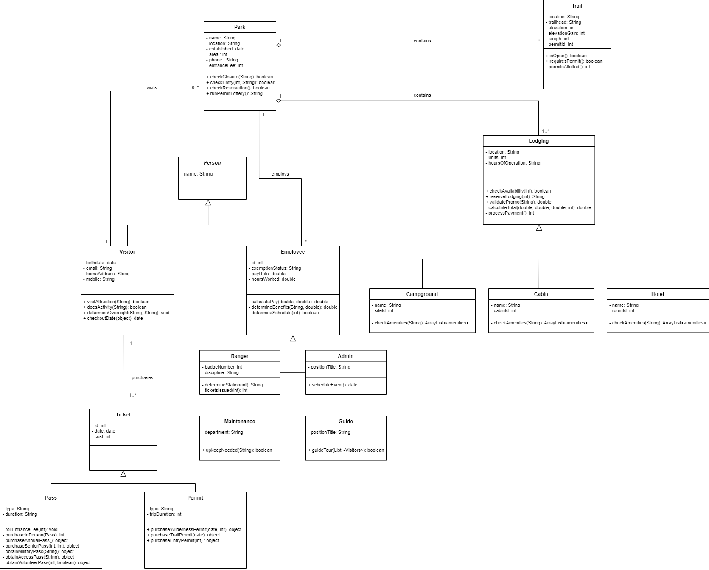
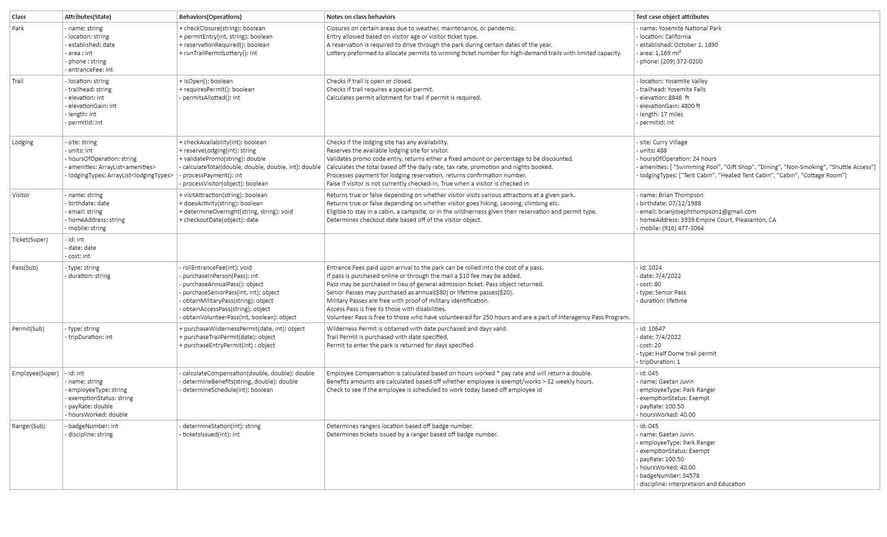

# National Parks Unified Modeling Language

This project is an implementation of Unified Modeling Language best practices to compose a class diagram modeling the National Park System.

## Decription

Below is the a class diagram for the National Parks System. This diagram models the various classes within the National Park System, their attributes, and corresponding behaviors. 
Additionally following the Notes on Diagram section there is a class table for additional color.
## National Parks Class Diagram

## Notes on Diagram

1. Association direction: In general relationships and their associated verb are to be read from left to right and from top to bottom. Instances where the relationship and verb are to be read from right to left or from bottom to top will be represented by the symbols < and ^ respectively preceding the association verb. 
2. Relationships:

* Associations: 

    * A visitor may visit 0 or more parks. 
    * A visitor purchases 1 to many tickets(permit, pass). 
    * A park employs many employees(and rangers). 
    * Many employees may assist 0 to many visitors. 

* Aggregation: 

    * A park contains many trails. Trails exist independent of National Park. 
    * A park contains 1 to many lodging options. Certain lodging options exist outside of National Park(camp grounds). 

* Inheritance: 

    * Employee is the superclass of the subclass Ranger. 
    * Ticket is the superclass of the subclasses Pass and Permit. 

### Class Attributes and Behaviors Table

The below National Parks class table was designed to give additional insight into behavior logic and provide example instances of each class.

